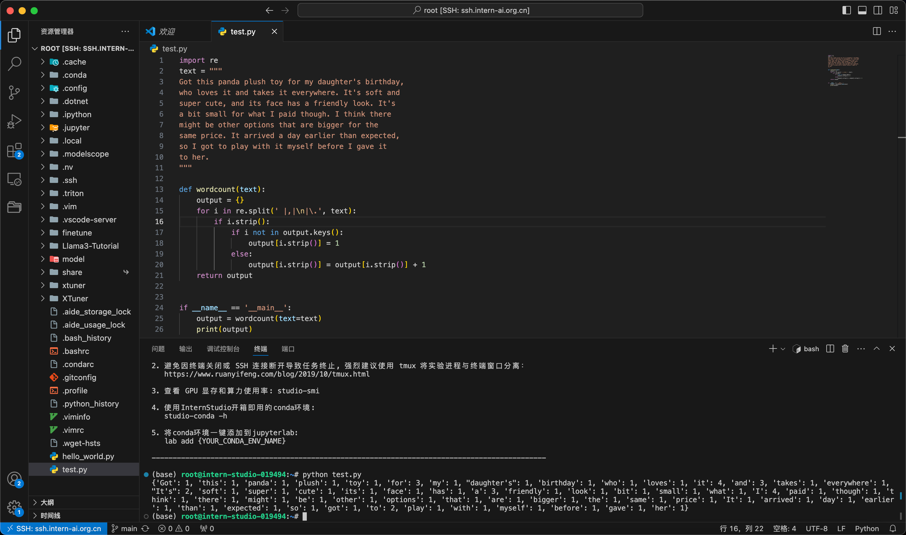

#### 脚本
```python
import re
text = """
Got this panda plush toy for my daughter's birthday,
who loves it and takes it everywhere. It's soft and
super cute, and its face has a friendly look. It's
a bit small for what I paid though. I think there
might be other options that are bigger for the
same price. It arrived a day earlier than expected,
so I got to play with it myself before I gave it
to her.
"""

def wordcount(text):
    output = {}
    for i in re.split(' |,|\n|\.', text):
        if i.strip():
            if i not in output.keys():
                output[i.strip()] = 1
            else:
                output[i.strip()] = output[i.strip()] + 1
    return output


if __name__ == '__main__':
    output = wordcount(text=text)
    print(output)
```

#### ssh远程连接


#### 脚本执行
